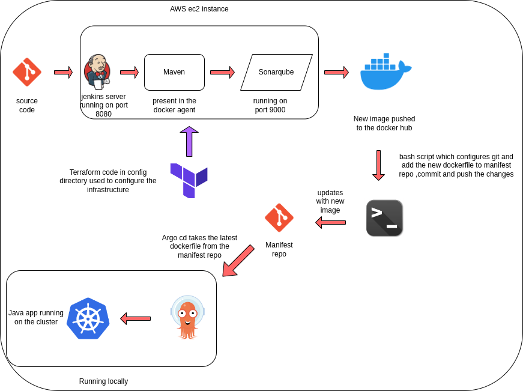

# Jenkins End-to-End Pipeline for java-app

This comprehensive DevOps project showcases the implementation of a robust CI/CD pipeline leveraging Terraform, Jenkins, and AWS Cloud services. The project is meticulously divided into key phases covering infrastructure setup, application deployment, and continuous integration and deployment processes. Notable highlights include configuring VPCs, deploying EC2 instances, setting up Jenkins pipelines, automating Docker containerization, integrating SonarQube for code analysis, and deploying applications using Argo CD on Kubernetes clusters. By making this project, I gained hands-on experience in modern DevOps practices, including infrastructure automation, continuous integration, and deployment, which are essential skills for driving efficiency and scalability in software development workflows.

Steps after setting up the infrastructure using terraform:

    1. Install the necessary Jenkins plugins:
       1.1 Git plugin
       1.2 Maven Integration plugin
       1.3 Pipeline plugin

    2. Create a new Jenkins pipeline:
       2.1 In Jenkins, create a new pipeline job and configure it with the Git repository URL for the Java application.
       2.2 Add a Jenkinsfile to the Git repository to define the pipeline stages.

    3. Define the pipeline stages:
        Stage 1: Checkout the source code from Git.
        Stage 2: Build the Java application using Maven.
        Stage 4: Run SonarQube analysis to check the code quality.
        Stage 5: Package the application into a JAR file.
        Stage 8: Promote the application to a production environment using Argo CD.

    5. Set up Argo CD:
        Install Argo CD on the Kubernetes cluster.
        Set up a Git repository for Argo CD to track the changes in the Helm charts and Kubernetes manifests.

    6. Configure Jenkins pipeline to integrate with Argo CD:
       6.1 Add the Argo CD API token to Jenkins credentials.
       6.2 Update the Jenkins pipeline to include the Argo CD deployment stage.

    7. Run the Jenkins pipeline:
       7.1 Trigger the Jenkins pipeline to start the CI/CD process for the Java application.
       7.2 Monitor the pipeline stages and fix any issues that arise.